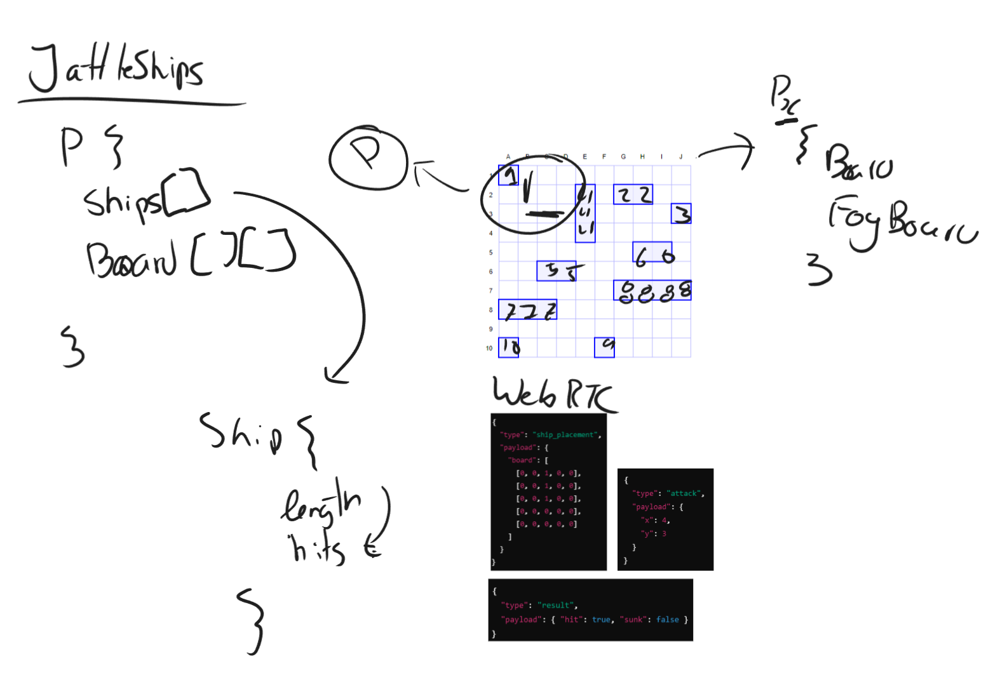

# JattleShips

Node.JS battleships over webRTC to allow me to own my girlfriend whilst at work

```sh
npm install TODO
```

## Dev

The only catch here is to make sure webRTC runs on your node and machine, for debian based,

```sh
sudo apt-get update
sudo apt-get install -y build-essential python3
```

and then node-gyp which is a build tool for node,

```sh
npm install -g node-gyp
```

finally wrtc, which is the webRTC implementation for node,

```sh
npm install wrtc
```

## Plan

This makes sense, I swear


