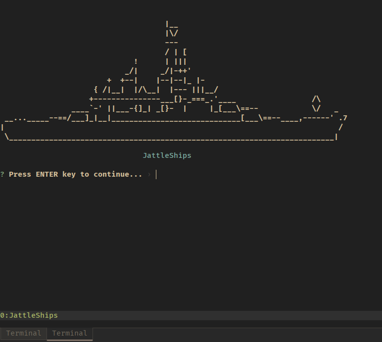

# JattleShips

Node.JS battleships over webRTC to allow me to own my girlfriend whilst at work



```sh
npm install TODO
```

## Preview

TODO

## Dev

The only catch here is to make sure webRTC runs on your node and machine, for debian based,

```sh
sudo apt-get update
sudo apt-get install -y build-essential python3
```

and then node-gyp (and pre) which is a build tool for node,

```sh
npm install -g node-gyp node-pre-gy
```

finally wrtc, which is the webRTC implementation for node,

```sh
npm install wrtc
```

## Plan

This makes sense, I swear


> this all changed, kinda

### TODO

- Implement a smoother terminal experience
- Save scores against player IDs locally
- Improve share code experience
- Error catch and validate inputs fully
